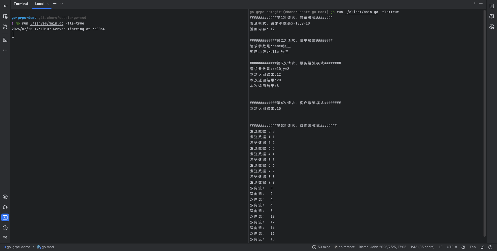

# Golang && gRPC && Demo

有关 grpc 协议，可以 google 搜索下，可以和 http 协议做对比理解和学习。k8s 中大量使用此种协议。

## 项目简介

这个 demo 来自于一个 fork，原项目[地址](https://github.com/zlingqu/go-grpc-demo)。

**请注意，在使用这个项目之前，请先通过这个[文档](./pre_confirm.md)以确认自己已经具备所有的基础环境了。**

该示例项目主要就是演示了 grpc 的四种服务方式，分别是

1. 简单模式（Unary RPC）

   介绍：客户端请求，服务端响响应。

   应用场景：

   - **数据库 CRUD 操作**：查询单个记录、创建资源等
   - **身份认证服务**：验证用户凭证并返回认证令牌
   - **配置管理**：获取或更新系统配置
   - **单次计算任务**：执行计算并返回结果
   - **微服务间简单调用**：获取其他服务的资源或状态

2. 服务端流模式（Server Streaming RPC）

   介绍：客户端发送一个请求，服务端返回多次。

   应用场景：

   - **大数据集分批返回**：查询大量数据时避免一次性加载
   - **实时监控**：持续监控服务器状态、容器运行状态等
   - **日志流式获取**：获取应用或系统日志流
   - **文件下载**：大文件分块传输
   - **事件订阅**：订阅特定资源的状态变化
   - **长连接通知推送**：服务端主动推送消息给客户端

3. 客户端流模式（Client Streaming RPC）

   介绍：客户端发送多次请求，服务端响应一次。

   应用场景：

   - **文件上传**：分块上传大文件
   - **批量数据处理**：批量导入或更新数据
   - **数据采集汇总**：收集多个传感器数据后进行汇总分析
   - **日志批量上报**：客户端批量发送日志数据
   - **流式计算**：客户端发送持续数据流，服务器最终返回计算结果
   - **长事务操作**：多步骤事务，最后一次性提交

4. 双向流（Bidirectional Streaming RPC）

   介绍：发送和接收同时进行，互不干扰。客户端和服务端都可以按任意顺序发送和接收消息。

   应用场景：

   - **实时聊天系统**：双方可以随时发送消息
   - **多人协作应用**：同步编辑文档或代码
   - **实时游戏通信**：游戏状态实时同步
   - **分布式系统协调**：节点间持续通信协调工作
   - **复杂的长连接通信**：如视频会议、语音通话
   - **流量控制场景**：动态调整数据传输速率

```go
// 简单模式。一个请求，一个响应。
rpc Add (TwoNum) returns (Response) {} //客户端发送一个请求，包含两个数字，服务端是返回两个数字的和
rpc SayHello (HelloRequest) returns (HelloReply) {} //发送一个name字符串，返回hello name

//服务端流模式，客户端发送一个请求，服务端返回多次。
rpc GetStream (TwoNum) returns (stream Response) {} //请求一次，返回三次，分别是两数子和、两数之积、两数之差

//客户端流模式，客户端发送多次请求，服务端响应一次。
rpc PutStream (stream OneNum) returns (Response) {}//请求中每次都是一个数字，发送完成后，服务端返回所有数字之和

//双向流，发送和接收同时进行，互不干扰
rpc DoubleStream (stream TwoNum) returns (stream Response) {} //每次请求都返回两个数字之和
```

## 目录说明

### 顶层目录与文件

- **Dockerfile**: 用于容器化 gRPC 服务
- **Makefile**: 包含项目构建、测试等自动化命令
- **README.md**: 项目说明文档
- **go.mod/go.sum**: Go 模块依赖管理文件

### gRPC 核心文件

#### api/proto/v1

- demo.proto: Protocol Buffers 定义文件，是 gRPC 的核心
  - 定义服务接口、方法和消息结构
  - 作为服务提供者与消费者之间的契约

#### pkg/pb/v1

- **demo.pb.go**: 由 protoc 编译器从 proto 文件生成的消息类型代码 [1](https://medium.com/stackpulse/grpc-in-practice-directory-structure-linting-and-more-d4d438ac4f86)
- demo_grpc.pb.go: 生成的 gRPC 服务接口代码，包括：
  - 服务器接口定义（需要实现的方法）
  - 客户端桩代码（用于调用远程方法）

#### scripts(gen proto)

- gen-proto.sh: 自动化脚本，用于将 proto 文件编译为 Go 代码
  - 调用 protoc 编译器及其 gRPC 插件生成上述 .pb.go 文件

### 安全通信相关文件

#### ca 和 certs 目录

- 用于 gRPC TLS 安全通信的证书文件
  - **ca.crt/ca.key**: 证书颁发机构证书和密钥
  - **server.crt/server.key**: 服务器证书和密钥
  - **server.csr**: 证书签名请求

#### scripts(gen certs)

- **gen-certs.sh**: 生成 TLS/SSL 证书的脚本

### 应用逻辑

#### cmd 目录

- server/main.go: gRPC 服务器入口
  - 实现 demo_grpc.pb.go 中定义的服务接口
  - 注册服务并启动 gRPC 服务器
- client/main.go: gRPC 客户端入口
  - 使用生成的客户端桩代码调用远程服务

### 文件间的关系与数据流

#### 服务定义流程

```shell
demo.proto → [gen-proto.sh/protoc] → demo.pb.go + demo_grpc.pb.go
```

#### 安全通信流程

```shell
gen-certs.sh → 生成TLS证书 → 用于服务器与客户端间的安全通信
```

#### 服务实现流程

```shell
demo_grpc.pb.go(接口) → server/main.go(实现) → 运行gRPC服务器
```

#### 服务调用流程

```shell
client/main.go → 使用demo_grpc.pb.go中的客户端代码 → 调用远程服务
```

### 总结

采用了良好的分层架构设计 [3](https://medium.com/@nate510/structuring-go-grpc-microservices-dd176fdf28d0):

1. **接口定义层**: api/proto 目录，与语言无关的服务契约
2. **代码生成层**: pkg/pb 目录，生成的代码不应手动修改
3. **应用层**: cmd 目录，实现具体业务逻辑

这种结构遵循了 Go 项目的最佳实践，同时满足了 gRPC 微服务的需要，便于扩展和维护 [4](https://www.reddit.com/r/golang/comments/dfe7ey/how_to_organize_the_structure_of_the_grpc_project/).

## 如何使用这个项目

注意：这部分代码，对于后面的 client 和 server 端的代码是共用的。

### demo.proto

protobuf 即 Protocol Buffers，是一种轻便高效的结构化数据存储格式。可以理解为和 json、XML 类似和语言无关，对别 json、xml 等有其自身的优势，详情可 google 下。

grpc 中使用此种方案对数据进行序列化、反序列化。

demo.proto 即是 protobuf 的源文件，该文件可以借助 [protoc 工具](https://github.com/protocolbuffers/protobuf/releases) 将其格式化成各种语言的代码，比如 go、java、python、js、php 等，详情可搜索下相关使用方法。

### demo.pb.go

将 demo.proto 转换成的 go 代码

```bash
# 安装插件，用于--go_out参数
go get -u github.com/golang/protobuf/protoc-gen-go

# 生成go代码
protoc --go_out=.  demo.proto
# go_out表示格式化成go代码，类似的还有java_out、python_out等
# go_out=.，最后的.表示生成的文件在当前目录
# demo.proto，表示执行的目标文件，这里使用相对路径，也可以用类似于 /root/abc/*.proto等方式
# 生成的文件名是固定的, 文件名+.pb+.go
```

### demo_grpc.pb.go

将 demo.proto 转换成的 go grpc 需要的相关代码

```bash
# 安装插件,用于--go-grpc_out参数
go install google.golang.org/grpc/cmd/protoc-gen-go-grpc
# 生成go grpc相关的代码
protoc --go-grpc_out=. demo.proto
# 可以和上一步写到一起
protoc --go_out=. --go-grpc_out=. demo.proto
```

### server

server 目录，服务端代码，运行方式

```bash
go run server/main.go

#如果使用tls,使用
go run server/main.go -tls=true

```

也可以将服务端跑到容器中，镜像打包见：Dockerfile

### client

client 目录，客户端代码，运行方式

```bash
go run client/main.go

#如果使用tls,使用-tls参数
go run client/main.go -tls=true

#指定服务端地址，使用-server_addr参数
go run client/main.go -server_addr="localhost:50054"
```

输出内容类似如下

```bash

#############第1次请求，简单模式########
普通模式，请求参数是x=10,y=10
返回内容: 12

#############第2次请求，简单模式########
请求参数是:name=张三
返回内容:Hello 张三

#############第3次请求，服务端流模式########
请求参数是:x=10,y=2
本次返回结果:12
本次返回结果:20
本次返回结果:8


#############第4次请求，客户端流模式########
本次返回结果:10


#############第5次请求，双向流模式########
发送数据 0 0
发送数据 1 1
双向流：  0
发送数据 2 2
发送数据 3 3
发送数据 4 4
发送数据 5 5
发送数据 6 6
发送数据 7 7
双向流：  2
双向流：  4
双向流：  6
双向流：  8
双向流：  10
双向流：  12
双向流：  14
双向流：  16
发送数据 8 8
发送数据 9 9
双向流：  18
```

### keys

相关证书文件。如果不使用 tls，这个文件夹无用。
文件夹的内容，也可以自己生成，参考：[useTls.md](useTls.md)

## 运行 tls

运行结果如下：



## 可视化调试工具

类似于 http 的调试工具 postman 一样，grpc 也有可视化工具，见：[grpcui GitHub](https://github.com/fullstorydev/grpcui)

可以直接下载二进制文件后，运行

```shell
grpcui -plaintext 127.0.0.1:50054
# 127.0.0.1:50054 表示grpc服务的ip和端口
```

注意，我写了一个脚本在 ./scripts/test_grpc.sh，这个脚本专门用于测试这个 grpc_server。

也需要额外注意的是，我的 grpc 开放的端口为 50054，而不是 50051（grpc 默认端口）。

此外，我还整了个 Dockerfile 优化。只需要执行命令：

```shell
docker build -t cheverjohn/go-grpc-demo:v0.1 .
```
即可构建出一个 grpc_server image。然后运行下面命令启动这个 image：

```shell
docker run -d -p 50051:50051 --name grpc-server cheverjohn/go-grpc-demo:v0.1
```
然后再执行我的 ./scripts/test_grpc.sh，就可以完美地测试好这个 server。


