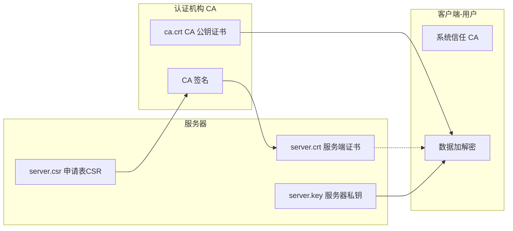

# 使用私有 ca 证书进行 grpc tls 通信

grpc如果使用tls通信，需要对证书进行相关操作，这里使用私有ca签署。

使用openssl工具进行证书操作。大致的过程分为以下几个部分：

1. 为了方便，首先魔改一下 `openssl.cnf` 文件。主要就是把一些默认信息改一下，并且添加我们的测试域名；
2. 开始证书创建 CA 证书。

## 预先准备信息

需要注意的是 `/etc/pki/tls` 和 `/opt/homebrew/etc/openssl@3` 文件夹分别是 OpenSSL 在不同系统和安装环境中的典型存储路径。它们的存在和差异可以用一篇简单的小短文来解释。但是这不是今天的重点。

我们需要找到本系统的 OpenSSL 配置文件目录：

运行如下命令，查看当前 OpenSSL 版本及它的配置文件目录：

```shell
openssl version -d
```

输出示例：

```shell
 [~/workspace/golang/src/grpc-demos/go-grpc-demo/ca/demoCA] - [Tue Feb 25, 15:15]
└─[$]> openssl version -d
OPENSSLDIR: "/opt/homebrew/etc/openssl@3"
```

所以我们的全局变量 `OpenSSL_PATH` 就是 `/opt/homebrew/etc/openssl@3` 了。

### 全局变量

```shell
OpenSSL_PATH: /opt/homebrew/etc/openssl@3
```

## 修改 openssl 配置文件

其实不应该介绍 openssl.cnf 的，这不是一篇实践文章该有的态度。回头叉出去:)

> 简单介绍一下 openssl.cnf 文件
>
> `openssl.cnf` 文件以及 `/etc/pki/CA/index.txt` 和 `serial` 文件的功能都与 OpenSSL 管理证书颁发机构 (Certificate Authority, CA) 的操作密切相关。以下是详细解析：
>
> 1. `openssl.cnf` 文件的作用
>
> `openssl.cnf` 是 OpenSSL 的配置文件，用于定义 OpenSSL 各种操作的默认行为。它包含了证书请求、证书生成、扩展设置和 CA 的配置信息。
>
> 主要用途：
>
> - **定义 CA 信息**: 包括 CA 证书路径、私钥路径、证书库目录等。
> - **定义证书字段规则**: 它定义了需包含在证书中的字段（如国家、组织、单位等）规则。
> - **定义扩展配置**: 比如支持 `subjectAltName`（用于多域名证书）。
> - **控制 OpenSSL 工具行为**: 配置文件影响 `openssl req`、`openssl ca`、`openssl x509` 等工具的行为。
>
> 一个常见的 `openssl.cnf` 文件片段示例：
>
> ```toml
> [ ca ]
> default_ca = CA_default
> 
> [ CA_default ]
> dir             = /etc/pki/CA         # CA 工作目录
> database        = $dir/index.txt      # 已颁发证书的数据库
> new_certs_dir   = $dir/newcerts       # 新发证书的位置
> certificate     = $dir/cacert.pem     # CA 的证书路径
> private_key     = $dir/private/cakey.pem # CA 的私钥路径
> serial          = $dir/serial         # 序列号文件路径
> default_days    = 365                 # 默认证书有效期
> default_md      = sha256              # 默认哈希算法
> policy          = policy_match        # 证书字段策略
> ```
>
> 2. `/etc/pki/CA/index.txt` 文件的作用
>
> `index.txt` 是 CA 的证书数据库，用于追踪已颁发的证书。
>
> **作用**：
>
> - 保存已颁发的证书信息。
> - 可以用来查询证书状态，例如是否吊销或过期。
> - OpenSSL 的 `ca` 子命令会更新这个文件，保持所有证书的完整记录。
>
> 每一行的格式如下（字段间用空格分隔）：
>
> ```txt
> V     230308110045Z    00    unknown    CN=example.com
> R     230207114500Z    01    unknown    CN=revoked-example.com
> ```
>
> 含义：
>
> - 第一列
>
>   : 包含状态信息：
>
>   - `V` 表示有效证书（Valid）。
>   - `R` 表示被吊销证书（Revoked）。
>   - `E` 表示过期证书（Expired）。
>
> - **第二列**: 证书有效期到期时间。
>
> - **第三列**: 证书序列号。
>
> - **第四列**: 保留字段，通常为 `unknown`。
>
> - **第五列及后续**: 证书的可区分名称（DN）。
>

### 复制默认的 openssl.cnf 文件

从我们的全局变量中获取到我们 openssl.cnf 文件。

```bash
#切换到home目录
cd
# 创建操作目录
mkdir ca && cd ca
cp /opt/homebrew/etc/openssl@3/openssl.cnf .
```
### 创建数据库文件 `index.txt`

```shell
# 创建 demoCA 文件夹及子文件夹
mkdir -p demoCA/certs
mkdir -p demoCA/crl
mkdir -p demoCA/newcerts
mkdir -p demoCA/private

# 初始化数据库文件 index.txt
touch demoCA/index.txt

# 创建序列号文件并初始化值为 01
echo 01 > demoCA/serial

# 设置权限保护私钥目录
chmod 700 demoCA/private
```

此处的 `demoCA` 文件夹的由来是根据 `openssl.cnf` 文件中的配置，我的 `openssl.cnf` 中的配置如下：

```shell
####################################################################
[ CA_default ]

dir		= ./demoCA		# Where everything is kept
certs		= $dir/certs		# Where the issued certs are kept
crl_dir		= $dir/crl		# Where the issued crl are kept
database	= $dir/index.txt	# database index file.
#unique_subject	= no			# Set to 'no' to allow creation of
					# several certs with same subject.
new_certs_dir	= $dir/newcerts		# default place for new certs.
..................................................................
```

当然你可以自己修改。

## 修改配置文件

```bash
vi openssl.cnf
#为了方便，[ req_distinguished_name ]段落我修改或添加了一些内容
countryName_default             = CN
stateOrProvinceName_default     = JiangSu
localityName_default            = NanJing
0.organizationName_default      = Chever
organizationalUnitName_default  = devops

#[ v3_req ]段落保证有如下内容
subjectAltName = @alt_names

# 文件最后添加如下内容，很重要，需要签发带"使用者备用名称(dns)"的证书用到
[ alt_names ]
DNS.1 = *.grpc.test.com
DNS.2 = dfe.example.org
DNS.3 = ex.abcexpale.net
```

> 简单介绍一下 `[ v3_req ]`：
>
> `[ v3_req ]` 是 OpenSSL 配置文件中的一个分段标识，表示 **v3 版本证书请求 (Certificate Signing Request, CSR)** 所需的扩展字段配置。
>
> 在证书的生命周期中，扩展字段（X.509 v3 extensions）用于提供额外的功能或信息，比如：
>
> - 是否是一个 CA 证书 (`basicConstraints`)。
> - 是否可以用于数字签名、加密 (`keyUsage`)。
> - 额外的使用者备用名称 (`subjectAltName`)，用于多域名或 IP 地址支持。
>
> - `subjectAltName`：
>   - **作用**：扩展字段，用于为证书添加使用者备用名称 (Subject Alternative Name, SAN)。这是 X.509 证书扩展的一部分。
>   - 意义：
>     - SAN 是现代浏览器和许多工具优先使用的字段，用于匹配请求的域名和证书的合法性。
>     - 配置 `subjectAltName` 后，证书可以适配多个域名或 IP 地址，而不仅限于 `CN=Common Name` 字段。
> - `[ alt_names ]`：
>   - 配置备用名称列表。
>   - 内容解析：
>     - `DNS.1 = *.grpc.test.com`: 添加通配符域名 `*.grpc.test.com`，适配该域名以及所有子域名，例如 `test.grpc.test.com`。
>     - `DNS.2 = dfe.example.org`: 添加域名 `dfe.example.org`。
>     - `DNS.3 = ex.abcexpale.net`: 添加域名 `ex.abcexpale.net`。
>
## 根证书相关操作

这一部分，创建证书

### 生成根 CA 的 4096 位长的 RSA 密钥

生成一段 4096 位的 RSA 私钥，输出到制定文件 `ca.key`。

```bash
# openssl genrsa -out ca.key 4096
Generating RSA private key, 4096 bit long modulus
.....++
........................................++
e is 65537 (0x10001)
```
当前目录生成ca.key文件。可复制命令：

```shell
openssl genrsa -out ca.key 4096
```

如果要加密码，需要加选项--aes256

```bash
openssl genrsa  -out ca.key 4096 --aes256
```

### 生成根证书

命令如下：

```shell
openssl req -new -x509 -days 36500 -key ca.key -out ca.crt -config openssl.cnf
```

使用上一步的私钥ca.key，自签证书ca.crt，有效期100年。

命令效果如下：

```bash
# openssl req -new -x509 -days 36500 -key ca.key -out ca.crt -config openssl.cnf
You are about to be asked to enter information that will be incorporated
into your certificate request.
What you are about to enter is what is called a Distinguished Name or a DN.
There are quite a few fields but you can leave some blank
For some fields there will be a default value,
If you enter '.', the field will be left blank.
-----
Country Name (2 letter code) [CN]:
State or Province Name (full name) [GuangDong]:
Locality Name (eg, city) [GuangZhou]:
Organization Name (eg, company) [dmai]:
Organizational Unit Name (eg, section) [devops]:
Common Name (eg, your name or your server's hostname) []:ca_server
Email Address []:
```

### 签发证书

#### 4096 位长的 RSA 密钥


```bash
# openssl genrsa -out server.key 4096
Generating RSA private key, 4096 bit long modulus
.........++
...........................................++
e is 65537 (0x10001)
```
这一步将生产 server.key 文件，下面会用到


#### 生成证书签发请求
```bash
# openssl req -new -key server.key -out server.csr -config openssl.cnf
You are about to be asked to enter information that will be incorporated
into your certificate request.
What you are about to enter is what is called a Distinguished Name or a DN.
There are quite a few fields but you can leave some blank
For some fields there will be a default value,
If you enter '.', the field will be left blank.
-----
Country Name (2 letter code) [CN]:
State or Province Name (full name) [GuangDong]:
Locality Name (eg, city) [GuangZhou]:
Organization Name (eg, company) [dmai]:
Organizational Unit Name (eg, section) [devops]:
Common Name (eg, your name or your server's hostname) []:grpc-demo
Email Address []:

Please enter the following 'extra' attributes
to be sent with your certificate request
A challenge password []:
An optional company name []:
```
这一步将生产server.csr文件，下面会用到

#### 签发证书

利用ca.crt、server.key、server.csr，生成服务端证书

需要创建文件夹，之后才能够运行下面命令。创建文件夹命令如下：

```shell
# 创建 demoCA 文件夹及子文件夹
mkdir -p demoCA/certs
mkdir -p demoCA/crl
mkdir -p demoCA/newcerts
mkdir -p demoCA/private

# 初始化数据库文件 index.txt
touch demoCA/index.txt

# 创建序列号文件并初始化值为 01
echo 01 > demoCA/serial

# 设置权限保护私钥目录
chmod 700 demoCA/private
```

然后运行下面命令签发证书：

```bash
# openssl ca -in server.csr -out server.crt -cert ca.crt -keyfile ca.key -extensions v3_req -config openssl.cnf
Using configuration from openssl.cnf
Check that the request matches the signature
Signature ok
Certificate Details:
        Serial Number: 4 (0x4)
        Validity
            Not Before: Apr 20 10:16:17 2021 GMT
            Not After : Apr 20 10:16:17 2022 GMT
        Subject:
            countryName               = CN
            stateOrProvinceName       = GuangDong
            organizationName          = dmai
            organizationalUnitName    = devops
            commonName                = grpc-demo
        X509v3 extensions:
            X509v3 Basic Constraints: 
                CA:FALSE
            X509v3 Key Usage: 
                Digital Signature, Non Repudiation, Key Encipherment
            X509v3 Subject Alternative Name: 
                DNS:*.grpc.test.com, DNS:dfe.example.org, DNS:ex.abcexpale.net
Certificate is to be certified until Apr 20 10:16:17 2022 GMT (365 days)
Sign the certificate? [y/n]:y


1 out of 1 certificate requests certified, commit? [y/n]y
Write out database with 1 new entries
Data Base Updated
```
这一步生产server.crt证书文件.

查看证书内容,注意证书中的"DNS:*.grpc.test.com, DNS:dfe.example.org, DNS:ex.abcexpale."，这是grpc客户端校验的关键
```bash
# openssl x509 -noout -text  -in server.crt 
Certificate:
    Data:
        Version: 3 (0x2)
        Serial Number: 4 (0x4)
    Signature Algorithm: sha256WithRSAEncryption
        Issuer: C=CN, ST=GuangDong, L=GuangZhou, O=dmai, OU=devops, CN=ca_server
        Validity
            Not Before: Apr 20 10:16:17 2021 GMT
            Not After : Apr 20 10:16:17 2022 GMT
        Subject: C=CN, ST=GuangDong, O=dmai, OU=devops, CN=grpc-demo
        Subject Public Key Info:
            Public Key Algorithm: rsaEncryption
                Public-Key: (4096 bit)
                Modulus:
                    00:......(省略)....f7
                Exponent: 65537 (0x10001)
        X509v3 extensions:
            X509v3 Basic Constraints: 
                CA:FALSE
            X509v3 Key Usage: 
                Digital Signature, Non Repudiation, Key Encipherment
            X509v3 Subject Alternative Name: 
                DNS:*.grpc.test.com, DNS:dfe.example.org, DNS:ex.abcexpale.net
    Signature Algorithm: sha256WithRSAEncryption
         45:......(省略)....db:2c
```


至此一共产生5个文件+1个配置文件，如下：

```bash
# tree
.
├── ca.crt       # CA 证书（公钥证书）
├── ca.key       # CA 私钥
├── openssl.cnf  # OpenSSL 配置文件
├── server.crt   # 服务端证书
├── server.csr   # 服务端证书签名请求文件 (CSR)
└── server.key   # 服务端私钥
```

## 解释一下这几个文件

```shell
# tree
.
├── ca.crt       # CA 证书（公钥证书）
├── ca.key       # CA 私钥
├── openssl.cnf  # OpenSSL 配置文件
├── server.crt   # 服务端证书
├── server.csr   # 服务端证书签名请求文件 (CSR)
└── server.key   # 服务端私钥
```

### ca.crt (CA 证书)

- 作用：
  - 这是 Certificate Authority (CA) 的公钥证书，用来证明 CA 的身份，并用它来验证由 CA 签发的服务器证书是否可信。
  - 所有信任你的服务器的人或系统都需要拥有该 CA 的证书。
- **通俗解释**： 这是类似于“权威认证机构颁发的身份证”，证明这个 CA 是合法的。比如说，你是一个知名的“认证公司”，给别人颁发可信身份。

------

### ca.key (CA 私钥)

- 作用：
  - 这是 CA 的**私钥**，用来给证书签名（生成一个合法的服务端证书）。
  - 必须极其保密！一旦泄露，别人就可以假冒 CA 签发伪造证书，危害整个信任体系。
- **通俗解释**： 这是 CA 的“官方印章”。CA 使用这个印章签发证书，表示 CA 对证书的真实性负责。

------

### openssl.cnf (配置文件)

- 作用：
  - 这是 OpenSSL 的配置文件，定义了证书生成时的具体规则，如使用的算法、有效期、扩展字段（如 `subjectAltName`），以及系统默认的 CA 工作目录。
  - 签发证书时，OpenSSL 工具会依照这个配置文件的指引。
- **通俗解释**： 配置文件就像“证书工厂的生产说明书”，告诉工厂如何生产证书、贴什么标签，以及有哪些必要的流程。

------

### server.csr (服务端证书签名请求文件)

- 作用：
  - **CSR (Certificate Signing Request)** 是服务端准备的证书请求文件，包含服务器的公钥及其他信息（如服务器的域名）。
  - 它是服务端向 CA 申请证书的文件。
- **通俗解释**： 这就好比服务器在向 CA 申请身份证时提交的申请表格，上面填写了你的名字（如域名）、照片（如公钥），并附上签名（私钥的验证）。

------

### server.key (服务端私钥)

- 作用：
  - 服务端的私钥，用来解密客户端请求中通过公钥加密的数据，或者用来生成数字签名证明服务器身份。
  - **必须严格保密！** 如果泄露，会导致服务器数据可能被解密，或者身份被伪造。
- **通俗解释**： 服务端的私钥是“只有自己知道的秘密钥匙”。比如，你买了一把保险柜（公钥），大家都可以使用保险柜存东西，但钥匙（私钥）就只有你能用来打开。

------

### server.crt (服务端证书)

- 作用：
  - 服务端的证书文件，是由 CA 签名的服务器公钥证书，包含了服务器的域名和认证信息。
  - 客户端浏览器（如 Chrome、Firefox）会信任 CA 签发的证书，用来建立 HTTPS/TLS 连接。
- **通俗解释**： 服务端证书相当于服务器的“身份证”，它由 CA 签发，证明你的数据是来自合法的服务器。浏览器看到这个证书后，会验证它的真实性，并信任你的身份。

## 案例场景：一个咖啡店网站的 HTTPS 安全通信



假设你（作为老板）建立了一个咖啡店网站 `www.cafeexample.com`，并想让用户通过 **HTTPS 安全通信**，以下是如何使用这些文件的：

------

### CA 证书角色 (ca.crt 和 ca.key)

想象你是一个国家级机构，专门发放身份证：

- 你有一套权威的认证机制：
  - 你的 **官方印章**（`ca.key`）用来签发身份证。
  - 你的信誉（`ca.crt`）被所有人认可，比如银行、警察局等都信任你。

------

### 服务器角色 (server.key, server.csr 和 server.crt)

咖啡店老板到你这里来（作为 CA），他说他想申请一个网站的身份证：

1. **生成私钥和 CSR**：
   - 老板生成了自己的“私钥”（`server.key`），并用它创建了一张带有域名（`www.cafeexample.com`）的申请表（`server.csr`）。
   - 私钥用于加密和认证服务器，以后只有老板自己知道这个私钥是什么。
2. **CA 给服务器签发证书**：
   - 你（CA）收到申请表（`server.csr`），认为老板的店是合法的，于是用你的官方印章（`ca.key`）签发了他的身份证（`server.crt`）。
   - 身份证上写了：**[www.cafeexample.com](http://www.cafeexample.com/) 是可信的网站，由 CA 签发**。
   - 你还把该身份证返回给了老板。

------

### 用户（客户端）的角色

用户在浏览器中访问 `www.cafeexample.com` 网站时：

1. 网站服务器会向用户展示自己的 **server.crt**（身份证）证明身份。
2. 浏览器会检查：
   - **server.crt 是否可信**：验证它是否由浏览器信任的 CA（`ca.crt`）签发。
   - **域名是否匹配**：确保证书的域名和用户访问的 `www.cafeexample.com` 一致。
3. 如果验证通过，浏览器就会信任网站，并建立安全的 HTTPS 通道。
